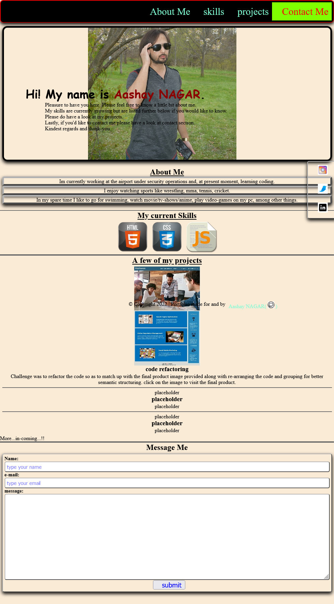

# Portfolio creation challenge

## Description

This end of week2 challenge is for craeting a portfolio to showcase any and all of the projects I have done so far and will be doing here on out.

Per my understanding 1 wasnt required to create a portfolio page that looked alike the gif image uploaded on campus page. Thus, i created the page by googling a basic portfolio layout and then implementing my skills (how much ever limited they currently are!) from there on.

I did keep in mind, the acceptance criteria and do hope I followed through one them all. please do acknowledge if otherwise!

Other than the timing challenge because of my job's wonky timings and length there-of, which sadly had me start the project later in the week, I did come across other challenges. Mainly, I found myself frustrated early on and then project 1's sudden changes made me more frustrated which led me to unknowingly delete my files to this assessment. As such I had to ask for a submission extention as I wasn't sure i could have finished it in time at that point. There were other smaller challenges like project1 clickable image-link not behaving as expected,  scroll up arrow no being responsive, etc. They have delt with.

## As for the html/css/javascript code details, they are listed below

    html code:
        - in <head> tag, Added a viewport meta to have the page function across diff viewports along with stylesheet linking. Was intrigued by the icons showing up on site's tabs in chrome so searched that up and added one of my own custom name icon.
        - Added lots of content in the <body> tag. Namely:
          - A menu-bar with clickables for any viewer to jump to the corresponding section.
          - An introductory hero section and hero image.
          - A small About me section.
          - A floating social widgets section with links to social media pages. (not added atm for privacy reasons instead of "placeholder tags", unless advised otherwise!).
          - A skills sections with badges of the various said skills.
          - A projects section to show-off the past, present and placeholders for future projects. Made sure to use an image preview of the project as a clickable link.
          - A contact Me section.
          - A functioning scroll button with image as the button.
          - A footer section with github link to access profileand projects right from the portfolio. <find and click the kitty for github>.
    Css code:
        - Properties per element to make adjustments to satisfy the look, feel and functionality of the webpage. Hopefully in a good symentic ordering.
        - tried my hardest to add media queries for screen size responsiveness but the more I kept on trying to fix it per different sizes, the harder it became and the more messed up it got at all other sizes...rather than submit a completely messed up work I ended up removing it for now.
    Javascript code:
        - Added QuerySelector and eventlistener tags for scroll functionality to be responsive.

## challenges

    - As mentioned above my biggest challenge (and infinitely frustrating one) ended up being the media queries for screen size responses. Sadly, to my disappointment i havent been able to overcome the challenge asit only kept on getting messier and messier from the start...
    - other challenges I have managed to overcome.

## Images

## Badges

